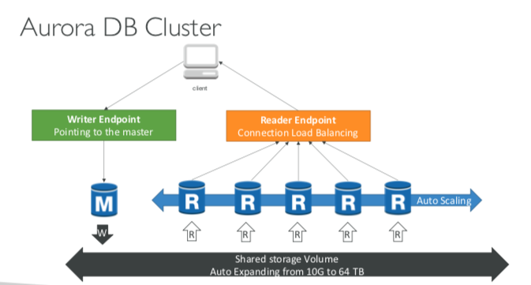

## RDS, Aurora 그리고 ElasticCache

## RDS

- RDS : Relational Database Service
- managed Db service
- Postgres, MySQL, MariaDB, Oracle, Microsoft SQL Server, Aurora (AWS Prorietry database)

### DB on EC2 vs RDS

- RDS 는 managed service
    - Automated provisioning, OS patching
    - Continuous backups and restore to specific timestamp (Point in Time Restore)! - Monitoring dashboards
    - Read replicas for improved read performance
    - Multi AZ setup for DR (Disaster Recovery)
    - Maintenance windows for upgrades
    - Scaling capability (vertical and horizontal) - Storage backed by EBS (gp2 or io1)
    
- 그러나 인스턴스에 SSH 로 붙지는 못하고, 붙지 못해도 상관없다.

### RDS 백업

- 백업이 자동으로 활성화되어있음
- 자동 백업
    - Daily full backup of the database (during the maintenance window)
    - Transaction logs are backed-up by RDS every 5 minutes
    - => ability to restore to any point in time (from oldest backup to 5 minutes ago) 
    - 7 days retention (can be increased to 35 days)
 
- 디비 스냅샷
 - 유저가 직접 트리거
 - 리텐션은 원하는 만큼 설정 가능
 
### RDS 스토리지 오토 스케일링

- 다이나믹한 스토리지 증설 가능
- RDS 가 용량없는 것 알면 자동으로 스케일링 함
- 수동으로 증설하는 걸 오히려 피해야함
- 최대 스토리지 처리량을 설정해야함 (스토리지 리밋)
- 다음과 같을 때 스토리지를 수정함
    - Free storage is less than 10% of allocated storage 
    - Low-storage lasts at least 5 minutes
    - 6 hours have passed since last modification
- 예측불가한 워크로드를 갖는 어플에 적합
- 모든 지원 엔진에 해당

### Read Replicas

- 5 개 까지 가능
- AZ 내, 크로스 AZ, 크로스 리전 3개에 따라 차이 있음
- ASYNC 이고, reads are eventually consistent
- 레플리카가 개별적 디비로 승격될 수 있음
- 어플리케이션이 리드 레플리카 이점 활용을 위해 커넥션 스트링을 업데이트해야함

### 유즈 케이스

- You have a production database that is taking on normal load
- You want to run a reporting application to run some analytics
- You create a Read Replica to run the new workload there
- The production application is unaffected
- Read replicas are used for SELECT (=read) only kind of statements (not INSERT, UPDATE, DELETE

### 레플리카 네트워크 비용

- 일반적으로 AZ -> AZ2 로 가는 데이터들에 비용이 매겨지지만
- 같은 리전 상 RDS Read Replicas 에 대해서는 청구안됨

### RDS Multi AZ (Disaster Recovery)

- SYNC replication
- One DNS name – automatic app failover to standby
- 가용성을 높인다.
- Failover in case of loss of AZ, loss of network, instance or storage failure
- No manual intervention in apps
- 스케일링 때문에 사용되진 않는다.
- Multi-AZ replication is free
- Note:The Read Replicas be setup as Multi AZ for Disaster Recovery (DR)

### 싱글 AZ -> Multi AZ

- 다운타임 없고 수정 버튼만 누르면 됨
- 아래 같은 프로세스가 내부적으로 동작
    - 스냅샷 찍힘
    - 새로운 디비가 새로운 AZ 에서 이 스냅샷으로 복원됨
    - 두 디비 사이에 동기화 연결 생성
 
 
### RDS Security - Encryption
- At rest encryption
    - Possibility to encrypt the master & read replicas with AWS KMS - AES-256 encryption
    - Encryption has to be defined at launch time
    - If the master is not encrypted, the read replicas cannot be encrypted
    - Transparent Data Encryption (TDE) available for Oracle and SQL Server

- In-flight encryption
    - SSL certificates to encrypt data to RDS in flight
    - Provide SSL options with trust certificate when connecting to database - To enforce SSL:
    - PostgreSQL: rds.force_ssl=1 in the AWS RDS Console (Parameter Groups)
    - MySQL:WithintheDB:
        - GRANT USAGE ON *.* TO 'mysqluser'@'%' REQUIRE SSL;
        
### RDS Encryption Operations
- Encrypting RDS backups
    - Snapshots of un-encrypted RDS databases are un-encrypted 
    - Snapshots of encrypted RDS databases are encrypted
    - Can copy a snapshot into an encrypted one

- To Snapshots of un-encrypted RDS databases
    - Create a snapshot of the un-encrypted database
    - Copy the snapshot and enable encryption for the snapshot
    - Restore the database from the encrypted snapshot
    - Migrate applications to the new database, and delete the old database

### RDS Security – Network & IAM
- Network Security
    - RDS databases are usually deployed within a private subnet, not in a public one
    - RDS security works by leveraging security groups (the same concept as for EC2 instances) – it controls which IP / security group can communicate with RDS
    
- Access Management
    - IAM policies help control who can manage AWS RDS (through the RDS API)
    - Traditional Username and Password can be used to login into the database
    - IAM-based authentication can be used to login into RDS MySQL & PostgreSQL

### RDS - IAM Authentication
- IAM database authentication works with MySQL and PostgreSQL
- You don’t need a password, just an authentication token obtained through IAM & RDS API calls
- Auth token has a lifetime of 15 minutes

- Benefits:
    - Network in/out must be encrypted using SSL
    - IAM to centrally manage users instead of DB
    - Can leverage IAM Roles and EC2 Instance profiles for easy integration

### RDS Security – Summary
- Encryption at rest:
    - Is done only when you first create the DB instance
    - or: unencrypted DB => snapshot => copy snapshot as encrypted => create DB from snapshot
    
- Your responsibility:
    - Check the ports / IP / security group inbound rules in DB’s SG
    - In-database user creation and permissions or manage through IAM
    - Creating a database with or without public access
    - Ensure parameter groups or DB is configured to only allow SSL connections
    
- AWS responsibility:
    - No SSH access
    - No manual DB patching
    - No manual OS patching
    - No way to audit the underlying instance

## 아마존 오로라
- Aurora is a proprietary technology from AWS (not open sourced)
- Postgres and MySQL are both supported as Aurora DB (that means your drivers will work as if Aurora was a Postgres or MySQL database)
- Aurora is “AWS cloud optimized” and claims 5x performance improvement over MySQL on RDS, over 3x the performance of Postgres on RDS
- Aurora storage automatically grows in increments of 10GB, up to 64 TB.
- Aurora can have 15 replicas while MySQL has 5, and the replication process
is faster (sub 10 ms replica lag)
- Failover in Aurora is instantaneous. It’s HA (High Availability) native.
- Aurora costs more than RDS (20% more) – but is more efficient

### 오로라 고가용성 과 리드 스케일링
- 6 copies of your data across 3 AZ:
    - 4 copies out of 6 needed for writes
    - 3 copies out of 6 need for reads
    - Self healing with peer-to-peer replication 
    - Storage is striped across 100s of volumes
- One Aurora Instance takes writes (master)
- Automated failover for master in less than 30 seconds
- Master + up to 15 Aurora Read Replicas serve reads
- Support for Cross Region Replication

### 오로라 클러스터



### Features of Aurora
- Automatic fail-over
- Backup and Recovery
- Isolation and security
- Industry compliance
- Push-button scaling
- Automated Patching with Zero Downtime
- Advanced Monitoring
- Routine Maintenance
- Backtrack: restore data at any point of time without using backups

### Aurora Security
- Similar to RDS because uses the same engines
- Encryption at rest using KMS
- Automated backups, snapshots and replicas are also encrypted
- Encryption in flight using SSL (same process as MySQL or Postgres) 
- Possibility to authenticate using IAM token (same method as RDS) 
- You are responsible for protecting the instance with security groups - You can’t SSH

## 아마존 ElastiCache

- The same way RDS is to get managed Relational Databases...
- ElastiCache is to get managed Redis or Memcached
- Caches are in-memory databases with really high performance, low latency
- Helps reduce load off of databases for read intensive workloads
- Helps make your application stateless
- AWS takes care of OS maintenance / patching, optimizations, setup, configuration, monitoring, failure recovery and backups
- Using ElastiCache involves heavy application code changes


### ElastiCahe 구조

- Applications queries ElastiCache, if not available, get from RDS and store in ElastiCache.
- Helps relieve load in RDS
- Cache must have an invalidation strategy to make sure only the most current data is used in there.

### 세션 클러스터링 유즈케이스
- User logs into any of the application
- The application writes the session data into ElastiCache
- The user hits another instance of our application
- The instance retrieves the data and the user is already logged in

### Redis vs Memcached
REDIS
- Multi AZ with Auto-Failover
- Read Replicas to scale reads and have high availability
- Data Durability using AOF persistence
- Backup and restore features

MEMCACHED
- Multi-node for partitioning of data (sharding)
- No high availability (replication)
- Non persistent
- No backup and restore
- Multi-threaded architecture

### 고려할만한 점

- Read more at: https://aws.amazon.com/caching/implementation-considerations/

- Is it safe to cache data? Data may be out of date, eventually consistent
- Is caching effective for that data?
    - Pattern: data changing slowly, few keys are frequently needed
    - Anti patterns: data changing rapidly, all large key space frequently needed
    
- Is data structured well for caching?
    - example: key value caching, or caching of aggregations results
    
- Which caching design pattern is the most appropriate?

### 전략 1. Lazy Loading / Cache-Aside / Lazy Population

- Pros
    - Only requested data is cached (the cache isn’t filled up with unused data)
    - Node failures are not fatal (just increased latency to warm the cache)
- Cons
    - Cache miss penalty that results in 3 round trips, noticeable delay for that request
    - Stale data: data can be updated in the database and outdated in the cache
    
```python
def get_user(user_id):
    record = cache.get(user_id)

    if record is None:
        record = db.query("select * from users where id = ?", user_id)
        
        cache.set(user_id, record)
        return record
    else:
        return record

    user = get_user(17)
```

### 전략2. Write Through – Add or Update cache when database is updated

- Pros:
    - Data in cache is never stale, reads are quick
    - Write penalty vs Read penalty (each write requires 2 calls)
- Cons:
    - Missing Data until it is added / updated in the DB. Mitigation is to implement Lazy Loading strategy as well
    - Cache churn – a lot of the data will never be read
          
```python
def save_user(user_id, values):
    record = db.query("update users ... where id = ?", user_id, values)
    
    cache.set(user_id, record)
    return record

user = save_user(17, {...})
```

1, 2 같이 쓸 수 있음

### 캐시 에빅션과 TTL
- Cache eviction can occur in three ways: - You delete the item explicitly in the cache
- Item is evicted because the memory is full and it’s not recently used (LRU) 
- You set an item time-to-live (or TTL)
- TTL are helpful for any kind of data: 
    - Leaderboards
    - Comments
    - Activity streams
- TTL can range from few seconds to hours or days
- If too many evictions happen due to memory, you should scale up or out

### Final words of wisdom
- Lazy Loading / Cache aside is easy to implement and works for many situations as a foundation, especially on the read side
- Write-through is usually combined with Lazy Loading as targeted for the queries or workloads that benefit from this optimization
- Setting a TTL is usually not a bad idea, except when you’re using Write-through. Set it to a sensible value for your application
- Only cache the data that makes sense (user profiles, blogs, etc...)

- Quote:There are only two hard things in Computer Science: cache invalidation and naming things

### 캐시 레플리케이션: Cluster Mode Disabled
- One primary node, up to 5 replicas
- Asynchronous Replication
- The primary node is used for read/write 
- The other nodes are read-only
- One shard, all nodes have all the data
- Guard against data loss if node failure
- Multi-AZ enabled by default for failover 
- Helpful to scale read performance

### 캐시 레플리케이션: Cluster Mode enabled
- Data is partitioned across shards (helpful to scale writes)
- Each shard has a primary and up to 5 replica nodes (same concept as before)
- Multi-AZ capability

- Up to 500 nodes per cluster:
    - 500 shards with single master
    - 250 shards with 1 master and 1 replica 
    - ...
    - 83 shards with one master and 5 replicas