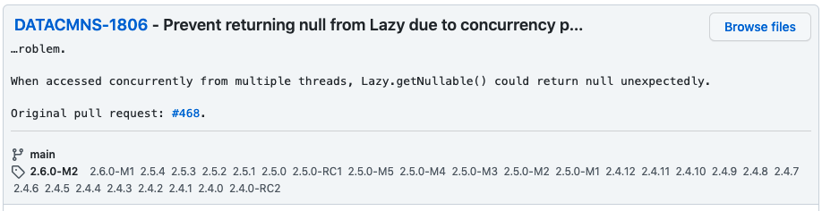

# spring-data 의 버그가 괴롭힐 줄이야

제가 속한 채권플랫폼팀 팀장님이자 ` ` miles 가 매주 수요일 진행하는 챕터에서 최근 일어났던 에러에 대한 원인을 공유해주셨는데요.
그 내용이 챕터에서만 공유되기엔 아까워서 글로 정리해보았습니다.

## 평화로운 오후, 느닷없는 에러

> org.springframework.dao.InvalidDataAccessApiUsageException: Expected lazy evaluation to yield a non-null value but got null!

평화로운 오후, 느닷없는 에러가 떴습니다. ... `null`, `lazy evaluation`? 섯부른 추측은 뒤로하고, 로그관리를 위해 사용 중인 `Graylog` 와 `sentry` 를 통해 스택 트레이스부터 살펴봐야겠습니다.

```
Caused by: java.lang.IllegalStateException: Expected lazy evaluation to yield a non-null value but got null!
	at org.springframework.data.util.Lazy.get(Lazy.java:97)
	at org.springframework.data.mapping.PreferredConstructor$Parameter.hasSpelExpression(PreferredConstructor.java:285)
	at org.springframework.data.mapping.model.SpELExpressionParameterValueProvider.getParameterValue(SpELExpressionParameterValueProvider.java:48)
	at org.springframework.data.convert.KotlinClassGeneratingEntityInstantiator$DefaultingKotlinClassInstantiatorAdapter.extractInvocationArguments(KotlinClassGeneratingEntityInstantiator.java:230)
	at org.springframework.data.convert.KotlinClassGeneratingEntityInstantiator$DefaultingKotlinClassInstantiatorAdapter.createInstance(KotlinClassGeneratingEntityInstantiator.java:204)
	at org.springframework.data.convert.ClassGeneratingEntityInstantiator.createInstance(ClassGeneratingEntityInstantiator.java:84)
	at org.springframework.data.mongodb.core.convert.MappingMongoConverter.read(MappingMongoConverter.java:321)
	...
	at org.springframework.data.mongodb.core.MongoTemplate.execute(MongoTemplate.java:585)
	at org.springframework.data.mongodb.core.MongoTemplate.doAggregate(MongoTemplate.java:2172)
	at org.springframework.data.mongodb.core.MongoTemplate.aggregate(MongoTemplate.java:2141)
```

MongoDB 에 aggregate 를 요청한 뒤, 리스폰스에 맞게 객체를 생성하다 에러가 났습니다. 

조금 넉넉한 지점부터 실행 순서대로 코드를 분석해보면 (바쁘신 분은 `4-1.` 로 번호 매긴 주석부터!)

```java
// 1. 코틀린 클래스에 맞게 엔티티를 초기화해주는 클래스에요.
public class KotlinClassGeneratingEntityInstantiator extends ClassGeneratingEntityInstantiator {

    // ...중략

    // 1-1. 객체를 생성하기 위해, 해당 객체의 생성자의 인자를 순회하며 각각에 대응하는 값을 가져오는 함수입니다.
    private <P extends PersistentProperty<P>, T> Object[] extractInvocationArguments(
            @Nullable PreferredConstructor<? extends T, P> preferredConstructor, ParameterValueProvider<P> provider
    ) {
        // ...중략

        // 1-2. 생성자로부터 인자들 목록을 가져옵니다.
        List<Parameter<Object, P>> parameters = preferredConstructor.getParameters();
    
        for (int i = 0; i < userParameterCount; i++) {
    
            Parameter<Object, P> parameter = parameters.get(i);
            
            // 1-3. provider 를 통해 인자(parameter)에 해당하는 값을 알아냅니다. 
            // 이번 에러에서 provider 는 SpELExpressionParameterValueProvider 였네요.
            params[i] = provider.getParameterValue(parameter);
        }

        // ...중략
    }
    
    // ...중략
}
```

```java
// 2. 생성자 인자의 필드 어노테이션으로 @Value("#root.property ?: 0") 등과 같이 
// 스펠(SpEL) 표현식을 쓸 수 있는데요. 그러한 스펠에 대응하는 값을 제공하는 구현체군요. - 중요하진 않습니다.
public class SpELExpressionParameterValueProvider<P extends PersistentProperty<P>>
		implements ParameterValueProvider<P> {

        // ...중략
    
	@Nullable
	public <T> T getParameterValue(Parameter<T, P> parameter) {

            // 2-1. 파라미터가 Spel 표현식을 사용하고 있는 지 확인하고 있어요.
            if (!parameter.hasSpelExpression()) {
                // ...중략
            }
            
                // ...중략
	}
}
```

```java
// 3. 위의 parameter 구현체에요.
public static class Parameter<T, P extends PersistentProperty<P>> {

    // ...중략    

    private final Lazy<Boolean> hasSpelExpression;

    // ...중략    

    public Parameter(@Nullable String name, TypeInformation<T> type, Annotation[] annotations, @Nullable PersistentEntity<T, P> entity) {
        // ...중략
        // 3-3. Lazy.of( ) 인자 변수명은 supplier 에요. 다음 클래스에서 supplier 가 쓰여요.
        // StringUtils.hasText(...) 의 리턴 값은 불린이어서 null 일 수 없구요. 
        this.hasSpelExpression = Lazy.of(() -> StringUtils.hasText(getSpelExpression()));
    }

    // 3-1. 이게 호출되었어요.
    public boolean hasSpelExpression() {
        // 3-2. 여기서 this 는 parameter!
        return this.hasSpelExpression.get();
    }
    
    // ...중략
}
```

```java
public class Lazy<T> implements Supplier<T> {

	private final Supplier<? extends T> supplier;
	private @Nullable T value = null;
    private boolean resolved = false;

    // ...중략

    public T get() {
        // 4-1. 여기서 null 이 반환되었어요.
        T value = getNullable();
        
        if (value == null) {
            // 여기서 예외가 발생했어요!
            throw new IllegalStateException("Expected lazy evaluation to yield a non-null value but got null!");
        }

        return value;
    }

    // ...중략
    // 4-2. (여기가 제일 중요해요!)
    public T getNullable() {

        T value = this.value;
   
        // (4-4 부터 봐주세요.)
        // 4-5. 즉 여기서 this.resolved = true 였고
        // value 가 null 인 상태로 리턴되었다는 말이겠네요.
        if (this.resolved) {
            return value;
        }

        // 4-4. 위 3-3. 에 람다로 정의된 함수가 아래 supplier 란 이름으로 쓰입니다.
        // 거기서 얘기한 것처럼 supplier.get() 은 절대 null 일 수 없구요.
        // 다시말해 여기 라인 이하에서 value 는 반드시 not null 이겠어요.
        value = supplier.get();

        // 4-6. 엥...? 하지만 this.resolved = true 가 되는 경우는 여기 뿐이에요... 이상한데요?
        this.value = value;
        this.resolved = true;

        return value;
    }
}
```

이번 에러의 핵심인 `Lazy` 클래스의 코드와 주석을 바탕으로 짧게 정리하자면 `value 가 not null 일 때 비로소 resolved = true 인데, resolved = true 인 상태에서 value = null 인 경우` 가 발생했다고 할 수 있겠습니다.

miles 는 여기서 `스레드 동시성` 문제임을 의심하셨다는데요. 
더하여 [이 글](https://gitter.im/spring-projects/spring-data/archives/2018/05/23) 을 보고 확신하셨다고 합니다. 
실제로도 비즈니스 로직에서 해당 로직을 호출할 때 `Collection.parallelStream()` 을 호출했구요. 
빈 스코프도 thread 는 아니었습니다. 여러분은 문제의 원인을 눈치채셨나요?

## 원인은?

코드를 다시한번 보겠습니다. 힌트를 적어두었어요! 

만약 `Lazy` 클래스가 초기화된 직후, 두개의 스레드 A, B 가 `T getNullable()` 를 호출하면 어떻게 될까요?

```java
public class Lazy<T> implements Supplier<T> {
    
    // 여기 선언된 this.value, this.resolved 는 두 스레드가 공유하는 공유자원!
    private @Nullable T value = null;
    private boolean resolved = false;
    
    public T getNullable() {
        // 여기 선언된 value 는 스레드가 공유하지 않는 지역변수! 
        T value = this.value; // line 1
    
        if (this.resolved) { // line 2
            return value; // line 3
        }
    
        value = supplier.get(); // line 4
    
        this.value = value; // line 5
        this.resolved = true; // line 6
    
        return value; // line 7
    }
}
```

다음과 같은 상황을 가정해봅시다.

1. `Lazy` 클래스가 초기화된 직후이다.
1. **스레드 A** : line 1 ~ 6 을 수행한 직후이다.
1. **스레드 B** : line 1 을 **스레드 A** 가 line 5 를 수행하기 전에 실행했고, line 2 를 수행할 참이다.

this.resolved 는 공유자원이니, **스레드 B** 입장에서 line 2 를 true 로 인지하고 line 3 을 수행하겠군요.
... 어라? 리턴하려는 `value` 는 지역변수? 
line 5 에서 **스레드 A** 가 this.value 를 수행하기 전에 초기화했으니... 이런! 참조값이 다르겠군요.
`Lazy` 클래스가 초기화된 직후이니, **스레드 B** 가 리턴하는 값은 null 이 되겠어요 ㅠㅠ
결국 이런 흐름에서 Thread Safety 가 보장되지 않아 발생한 문제였던 셈이에요.

`Lazy` 클래스 정의는 스프링 데이터 라이브러리 spring-data-commons 아티팩트에 담겨있었는데, 
이 라이브러리의 버그였던 것입니다!!

## 그래서, 어떻게 해결했나요?

이 버그에 대한 픽스 커밋은 다행히 최근에 머지되었어요. 불과 10달 전이죠. 

수정된 내용은 [spring-projects/spring-data-commons@a442b90](https://github.com/spring-projects/spring-data-commons/commit/a442b9002181fa6461490d105a28dd187dd3c38d) 에서 확인할 수 있고요.



다행히도 마이너버전 업데이트로 해당 커밋을 반영하기에 충분했고, 
스프링 프로젝트들의 버전을 수정 커밋이 반영된 스프링 버전으로 업데이트하여 해결하였습니다. 
  
## 끝으로

장애에 대한 대응이 잘 이뤄졌다는 만족감도 좋았지만, 
그리고 직접적인 원인이었던 스레드 동시성에 관한 내용도 흥미로웠지만
무엇보다 이번 버그픽스 덕분에 스스로 느낀 바가 값졌던 것 같아요.

특히 `검증된 오픈소스라도 내 눈으로 코드를 보고 끝까지 원인을 짚어내자! 덮어놓고 믿지말자!` 란 생각이 들었거든요.
저는 이 에러를 만났을 때, 당연히 비즈니스 로직에 무언가 오류가 있을 것이라 생각해버렸습니다.
저는 스프링 쪽 버그일 것이란 생각은 한 번 하지않고 말이죠. 
그리곤 스프링에 관련한 스택 트레이스는 소홀히 한 채, 덮어놓고 의심하지 않았어요.

물론 보통 어플리케이션 에러들은 대부분 그 어플리케이션 코드에서 나오긴해요. 
빠른 원인파악을 위해서 가능성을 염두에 두고 코드를 보는 것도 합리적인 행동이고요.
하지만 그것을 핑계로 원인파악의 과정을 너무 안일하게 만들지 않았나 싶습니다 ㅎㅎ
오늘도 또 하나를 배운 느낌이군요.

이 글이 흥미로우셨길 바라며 글을 마칩니다.
감사합니다, 채권플랫폼팀 ian 이었습니다.