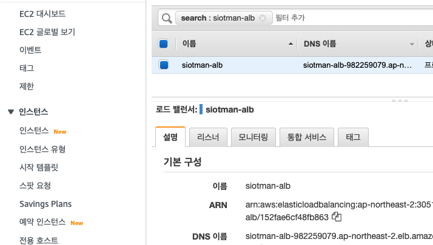
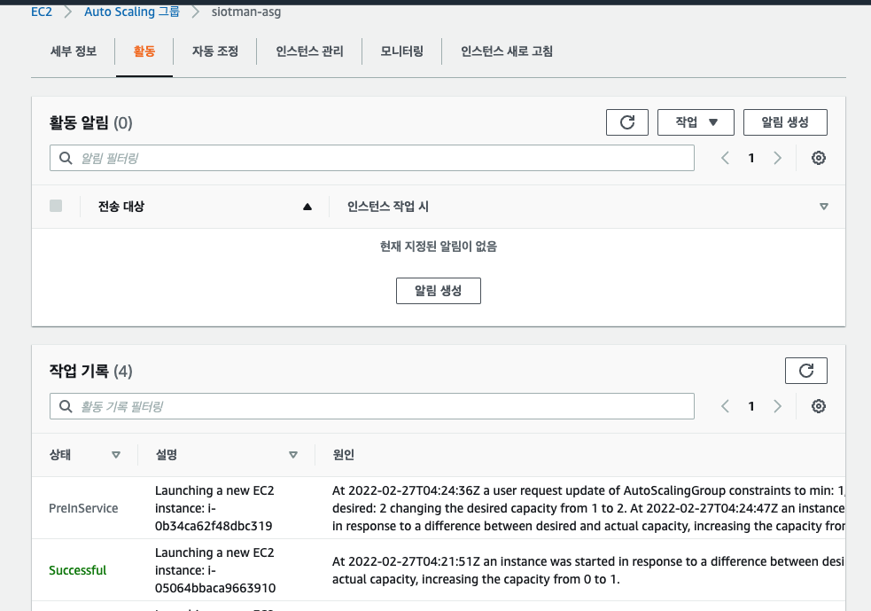
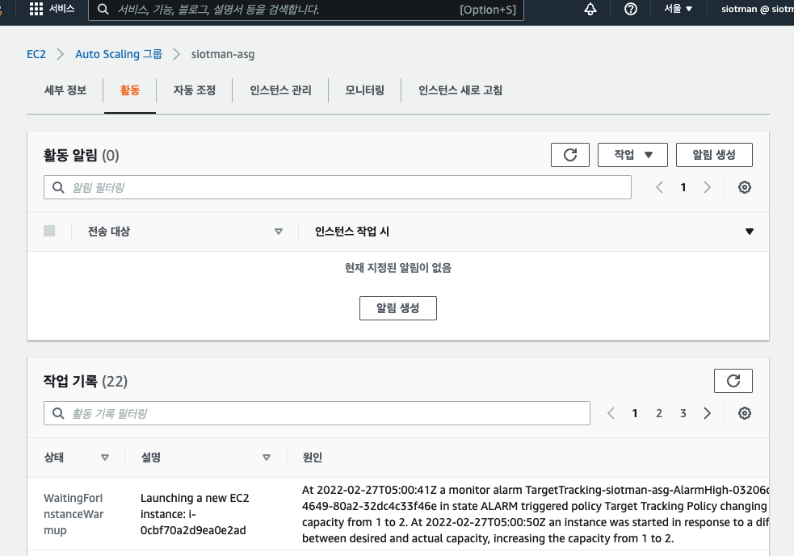

# W2 - 과제

상태: 진행 중
우선순위: 높음
작성일시: 2022년 2월 25일 오후 10:46
타임라인: 2022/02/25 → 2022/02/27

# 스터디 2주차 과제

- [Udemy AWS SAA 강의](https://www.udemy.com/course/best-aws-certified-solutions-architect-associate) 내 `고기용성 및 스케일링성: ELB 및 ASG`을 수강합니다.
- 아래의 과제를 수행하여 제출합니다.
- 과제제출 기한: 2/27(일) 23:59 (정기밋업: 3/1(화) 20:00)

## 실습 과제 (EC2 생성도 필요하네요!)

1) `Classic Load Balancer (CLB) 실습`을 수행하고 결과를 캡쳐합니다.


2) `Application Load Balancer (ALB) 실습`을 수행하고 결과를 캡쳐합니다.



3) `Network Load Balancer (NLB) 실습`을 수행하고 결과를 캡쳐합니다.


4) `Auto Scaling Group (ASG) 실습`을 수행하고 결과를 캡쳐합니다.
- ex) ASG를 구성하고 Desired Capacity, Minumum Capacity, Maximum Capacity를 값을 조정하여 scale-in 혹은 scale-out을 구현합니다.



5) `Auto Scaling Group (ASG) 실습 - 스케일링 정책 실습`을 수행하고 결과를 캡쳐합니다.
- ex) EC2에 스트레스를 주고 스케일링 아웃되도록 구현합니다.



## 연습문제

- `고가용성 및 스케일링성 퀴즈` (23문제) 풀이/해설을 제출하세요.

1) EC2 인스턴스를r4.large에서 r4.4xlarge로 스케일링하는 것을 … 이라 합니다.

```
A. 수평 스케일링성
B. 수직 스케일링성
```

정답 : B

수직 스케일링은 **인스턴스 크기의 변화**에 따른 스케일링이다.

2) EC2 인스턴스 수를 스케일링 및 축소하는 오토 스케일링 그룹 (ASG)에서 애플리케이션을 실행하는 것을 … 라고 합니다.

```
A. 수평 스케일링성
B. 수직 스케일링성

정답 : A

수평 스케일링은 인스턴스 갯수의 변화에 따른 스케일링이다.
```

3) Elastic Load Balancer는 … 을 제공합니다.

```
A. 애플리케이션에서 사용할 수 있는 정적 IPv4
B. 애플리케이션에서 사용할 수 있는 정적 DNS 이름
C. 애플리케이션에서 사용할 수 있는 정적 IPv6

정답 : B

ELB 는 정적 DNS 네임을 제공한다.
```

4) 여러분은 ELB 하나에 EC2 인스턴스 10개로 웹 사이트를 실행 중 입니다. 사용자들로부터 페이지 사이를 이동할 때 마다 재인증을 해야하는 것에 대해서 컴플레인이 들어오고 있습니다. 한 개의 EC2 인스턴스가 있는 개발 환경과 컴퓨터에서 웹페이지는 정상적으로 작동하기 때문에 여러분은 혼란에 빠졌습니다. 이 현상의 발생 이유는 무엇일까요?

```
A. 여러 EC2 인스턴스에서 호스팅할 때 웹 사이트에 문제가 있습니다.
B. EC2 인스턴스는 사용자가 자신의 IP 주소를 볼 수 없기 때문에 로그아웃하는 대신 ELB IP 주소를 수신합니다.
C. ELB 에 Stickey Session 이 활성화되어 있지 않습니다.

정답 : C

ELB 만으로 세션정보를 유지하려면, Stickey Session 옵션을 활성화해야한다.
```

5) 여러분은 ALB를 사용하여 EC2 인스턴스에서 호스팅되는 웹 사이트의 트래픽을 분산하고 있고 웹 사이트는 실제로 ALB의 IP 주소인 프라이빗 IPv4 주소에서 오는 트래픽만 인식하는 것으로 나타났습니다. 이때 웹사이트에 연결된 클라이언트의 IP 주소를 얻으려면 어떻게 해야 할까요

```
A. 사용자가 모든 요청에서 자신의 IP를 보내도록 웹사이트의 프런트엔드를 수정합니다.
B. X-Forwarded-For 헤더에서 클라이언트 IP 주소를 가져오도록 웹사이트의 백엔드를 수정합니다.
C. 웹사이트의 백엔드를 수정하여 X-Forwarded-Port 헤더에서 클라이언트 IP 주소를 가져옵니다.
D. 웹사이트의 백엔드를 수정하여 X-Forwarded-Proto 헤더에서 클라이언트 IP 주소를 가져옵니다.

정답 : B

ELB 로부터 얻을 수 있는 클라이언트의 실제 IP 주소는 X-Forwarded-For 헤더에 실려온다.
```

6) 여러분은 ELB 하나와 EC2 인스턴스 집합으로 애플리케이션을 호스팅하였습니다. 일주일 후, 유저들은 애플리케이션이 간헐적으로 작동을 멈춘다고 컴플레인을 하기 시작합니다. 조사 결과, 일부 EC2 인스턴스가 때때로 충돌하는 것을 발견했습니다. 이때 사용자가 충돌하는 EC2 인스턴스에 연결하지 못하도록 보호하려면 어떻게 해야 할까요?

```
A. ELB Health Checks 활성화
B. ELB Stickiness Checks 활성화
C. ELB Termination 활성화
D. Cross-Zone Load Balancing 활성화

정답 : A

헬스 체크를 통해 충돌하는 EC2 를 ELB 가 인지하고, 장애를 회피할 수 있도록 구성한다.
```

7) 여러분은 솔루션 아키텍트로써 초당 수백만 건의 요청을 수신할 고성능, 저지연 시간 애플리케이션을 위한 아키텍처를 설계하려 합니다. 이때 어떤 유형의 ELB를 선택해야 할까요?

```
A. ALB
B. CLB
C. NLB

정답 : C

3 개의 ELB 중 NLB 의 퍼포먼스가 가장 빠르다.
```

8) Application Load Balancer (ALB)가 지원하는 프로토콜이 아닌것은?

```
A. HTTP
B. HTTPS
C. TCP
D. WebSocket

정답 : C

ALB 는 7 레이어에서 동작하므로, 4 레이어 프로토콜인 TCP 보다 좁은 범위의 프로토콜을 지원한다.
```

9) ALB는 일정 기준에 따라 트래픽을 다른 대상 그룹으로 라우팅할 수 있습니다. 이 기준에 해당하지 않는 것은?

```
A. 고객의 위치(지역)
B. 호스트 이름
C. 요청 URL 경로
D. 소스 IP-주소

정답 : A

ALB는 URL 경로, 호스트 이름, HTTP 헤더 및 쿼리 문자열을 기반으로 트래픽을 다른 대상 그룹으로 라우팅할 수 있다.
```

10) 다음 중 ALB의 대상 그룹에 등록된 대상이 아닌 것은? - 될 수 있는 대상이 아닌 것은 이라 번역하는 것이 맞아보임.

```
A. EC2 인스턴스
B. NLB
C. 비공개 IP 주소
D. Lambda Funtions

정답 : B

NLB 는 ALB 를 Target Group 으로 지정할 수 있지만 ALB 는 NLB 를 TargetGroup 으로 지정할 수 없다.
```

11) 여러분은 규정 준수를 위해 최종 사용자에게 고정 IP 주소를 노출하여 규제 기관에서 승인한 안정적인 방화벽 규칙을 작성하도록 하려 합니다. 어떤 유형의 ELB를 선택하시겠습니까

```
A. 탄력적 IP 가 연결된 ALB
B. NLB
C. CLB

정답 : B

NLB 는 고정 IP 주소를 사용한다. AZ 당 하나의 고정 IP 주소가 있고, 탄력적 IP 주소를 연결할 수도 있다. 반면, ALB 와 CLB 는 정적 DNS 이름을 사용한다.
```

12) 다음 중 애플리케이션 로드 밸런서 (ALB)에서 사용자 지정 애플리케이션 기반 쿠키를 생성 시 쿠키 이름으로 사용할 수 있는 것은 무엇일까요?

```
A. AWSALBAPP
B. APPUSERC
C. AWSALBTG
D. AWSALB

정답 : B
```

13) 여러분은 us-east-1의 EC2 인스턴스 세트에 트래픽을 분산하는 네트워크 로드 밸런서 (NLB)가 있습니다. us-east-1b AZ에 2개의 EC2 인스턴스와 us-east-1e AZ에 5개의 EC2 인스턴스가 있습니다. us-east-1b AZ의 EC2 인스턴스에서 CPU 사용률이 더 높다는 것을 확인했습니다. 추가 조사 후 트래픽이 두 AZ에 균등하게 분산되어 있음을 알 수 있습니다. 이 문제를 어떻게 해결하시겠습니까?

```
A. Cross-Zone Load Balancing 활성화
B. Sticky Session 활성화
C. ELB Health Checks 활성화
D. SSL Termination 활성화

정답 : A

Cross-Zone LB 를 활성화하면, AZ 에 관계없이 모든 인스턴스에 트래픽을 고르게 분산시킬 수 있다.
```

14) 애플리케이션 로드 밸런서 (ALB)와 네트워크 로드 밸런서 (NLB)의 어떤 기능을 통해 하나의 리스너에서 여러 SSL 인증서를 로드할 수 있을까요?

```
A. TLS Termination
B. Server Name Indication (SNI)
C. SSL Security Policies
D. Host Headers

정답 : B

ALB 와 NLB 는 SNI 를 통해 요청자가 알려준 호스트 네임을 기반으로 SSL 인증서를 찾아 로드할 수 있다.
```

15) 여러분은 다음 호스트 이름을 기반으로 트래픽을 3개의 대상 그룹으로 리디렉션하도록 구성된 애플리케이션 로드 밸런서 (ALB)가 있습니다users.example.com, api.external.example.com 및 checkout.example.com. 이러한 각 호스트 이름에 대해 HTTPS를 구성하려고 합니다. 이 작업을 수행하려면 ALB를 어떻게 구성해야 할까요?

```
A. HTTP에서 HTTPS로의 리디렉션 규칙 사용
B. 보안 그룹 SSL 인증서 사용
C. Server Name Indication (SNI) 사용

정답 : C

HTTPS 를 지원하기 위해 SSL cert 가 필요하고, 각 호스트에 대해 HTTPS 를 구성해야하므로, SNI 를 통해 인증서를 로드할 수 있도록 각 호스트 네임에 대한 SSL 인증서 등록이 필요하다.
```

16) 여러분은 원하는 용량과 최대 용량을 모두 3으로 구성한 오토 스케일링 그룹 (ASG)에서 관리하는 EC2 인스턴스 세트에서 호스팅되는 애플리케이션이 있습니다. 또한 CPU 사용률이 60%에 도달하면 ASG를 스케일링하도록 구성된 CloudWatch 경보를 생성했습니다. 여러분의 애플리케이션은 갑자기 엄청난 트래픽을 수신했고 현재 80% CPU 사용률로 실행되고 있습니다. 이제 무슨 일이 일어날까요?

```
A. 아무일도 일어나지 않았습니다.
B. 원하는 용량은 최대 4개, 최대 용량은 3개로 유지됩니다.
C. 원하는 용량은 최대 4개로 증가하고, 최대 용량은 4개로 유지됩니다.

정답 : A

```

17) 여러분은 애플리케이션 로드 밸런서 (ALB)가 전면에 있는 오토 스케일링 그룹이 있습니다. ALB 상태 확인을 사용하도록 ASG를 구성했는데 하나의 EC2 인스턴스가 비정상으로 보고되었습니다. 이 EC2 인스턴스는 어떻게 될까요?

```
A. ASG는 인스턴스를 계속 실행하고 얘플리케이션을 다시 시작합니다.
B. ASG 는 EC2 인스턴스를 분리하고 계속 실행합니다.
C. ASG 는 EC2 인스턴스를 종료합니다.

정답 : C

ALB 가 EC2 상태 확인에 실패하여 Unhealthy 로 마킹하면, ASG 는 새 EC2 를 실행하는 동시에 해당 EC2 를 종료한다. 즉, 확장성을 그대로 유지한다.
```

18) 여러분의 상사는 애플리케이션이 데이터베이스에 대해 수행하는 분당 요청 수를 기반으로 오토 스케일링 그룹을 스케일링하도록 요청했습니다. 어떻게 해야 할까요?

```
A. CloudWatch 사용자 지정 지표를 생성한 다음 이 지표에 대한 CloudWatch 경보를 생성하여 ASG를 스케일링합니다.
B. 정중하게 불가능하다고 전합니다.
C. 세부 모니터링을 활성화한 다음 CloudWatch 경보를 생성하여 ASG 를 스케일링합니다.

정답 : A

CloudWatch 에 없는 지표라도, 사용자 지정 지표와 이에 대한 경보를 생성하여 ASG 스케일링 트리거로 쓸 수 있다.
```

19) 오토 스케일링 그룹 (ASG)에서 관리하는 EC2 인스턴스 플릿이 호스팅하는 웹 애플리케이션이 있습니다. 여러분은 애플리케이션 로드 밸런서 (ALB)를 통해 이 애플리케이션을 노출하고 있습니다. EC2 인스턴스와 ALB는 모두 다음 CIDR 192.168.0.0/18을 사용하여 VPC에 배포됩니다. ALB만 포트 80에서 액세스할 수 있도록 EC2 인스턴스의 보안 그룹을 구성하려면 어떻게 해야 할까요?

```
A. 포트 80 및 0.0.0.0/0 을 소스로 사용하여 인바운드 규칙 추가
B. 포트 80 및 192.168.0.0/18 을 소스로 사용하여 인바운드 규칙 추가
C. 포트 80 및 ALB 의 보안 그룹을 소스로 사용하여 인바운드 규칙 추가
D. ALB 에서 SSL 인증서 로드

정답 : C

ALB 의 보안 그룹을 EC2 인스턴스 보안 그룹의 소스로 사용할 수 있다.
```

20) eu-west-2 리전에서 실행 중인 오토 스케일링 Configured가 있으며 eu-west-2a 및 eu-west-2b 가용 영역 두 개를 생성하도록 구성되어 있습니다. 현재 eu-west-2a에서 EC2 인스턴스 3개와 eu-west-2b에서 EC2 인스턴스 4개가 실행 중입니다. ASG가 곧 축소됩니다. 어떤 EC2 인스턴스가 종료될까요?

```
A. eu-west-2a 의 임의 EC2 인스턴스
B. 가장 오래된 런치 템플릿 버전이 있는 eu-west-2a 의 EC2 인스턴스
C. eu-west-2b 의 임의 EC2 인스턴스
D. 가장 오래된 런치 템플릿 버전이 있는 eu-west-2b 의 EC2 인스턴스

정답 : D

[1] 가장 많은 수의 인스턴스를 가진 AZ 에서, [2] 가장 오래된 EC2 를 종료한다.
```

`번역이 좀 아쉬운데, eu-west-2b 의, 가장 오랜된 런치 템플릿 버전의 EC2 인스턴스 가 맞아보인다.`

21) 애플리케이션은 애플리케이션 로드 밸런서 (ALB) 및 오토 스케일링 그룹과 함께 배포됩니다. 현재 ASG를 수동으로 스케일링하고 EC2 인스턴스에 대한 평균 연결 수가 약 1000개인지 확인하는 스케일링 정책을 정의하려고 합니다. 어떤 스케일링 정책을 사용해야 할까요?

```
A. 단순 스케일링 정책
B. 단계 스케일링 정책
C. 대상 추적 정책
D. 예약 스케일링 정책

정답 : C

대상 추적 정책 == 지표를 트래킹하는 정책
```

22) 오토 스케일링 그룹 (ASG)가 관리하는 EC2 인스턴스에서 호스팅되는 애플리케이션이 갑자기 트래픽 급증을 수신하여 ASG가 스케일링되고 새 EC2 인스턴스가 시작되었습니다. 트래픽은 지속적으로 증가하지만 ASG는 새 EC2 인스턴스를 즉시 시작하지 않고 5분 후에 시작합니다. 이 동작이 가능한 원인은 무엇일까요?

```
A. 쿨다운 기간
B. 수명 주기 후크
C. 대상 추적 정책
D. 템플릿 시작

정답 : A

ASG 스케일링 시 쿨다운 기간을 갖는다.
```

23) 여러분의 회사에는 지난 달에 임의의 EC2 인스턴스가 갑자기 충돌한 오토 스케일링 그룹 (ASG)이 있습니다. ASG가 비정상 EC2 인스턴스를 종료하고 새 EC2 인스턴스로 교체할 때, EC2 인스턴스가 충돌하는 이유를 알아낼 수 없었습니다. 문제를 해결하고 비정상 인스턴스가 ASG에 의해 종료되는 것을 방지하기 위해 어떻게 해야할까요?

```
A. 종료하기 전에 AWS Lambda 를 사용하여 EC2 인스턴스 일시중지
B. ASG 수명 주기 후크를 사용하여 문제 해결을 위해 종료 중 상태의 EC2 인스턴스를 일시 중지
C. CloudWatch Logs 를 사용하여 문제 해결

정답 : B

시작할 때의 상태와 종료될 때에 상태 진입 전 훅을 달 수 있다.
```

## (선택) 연습문제 10개를 풀이/해설을 제출하세요. (번역이 어색한 점 양해바랍니다!)

1. Auto Scaling을 이용해 서버를 실행할 때 서버 타입에 대한 세부사항은 어디에서 정의할 수 있나요?

```
A. Auto Scaling Group
B. Launch Template or Launch Configuration
C. Elastic Load Balancer
D. Application Load Balancer
```

정답 : B

1. Healthcheck에서 Elasitc Load Balacing이 실패하면 어떤일이 발생하나요? (Choose the best appropriate answer)

```
A. Elasitc Load Balancing이 실패하면 다른 Load Balancer를 실행시킴
B. Elasitc Load Balancing이 인스턴스가 응답할 때까지 계속 회신을 요청함
C. Elasitc Load Balancing이 해당 인스턴스에 대한 트래픽을 차단하고 새 인스턴스를 실행시킴
D. 로드 밸런서는 용량이 더 큰 인스턴스를 실행시킴
```

1. 서버를 위한 Auto Scaling 메커니즘을 생성할 때 두 가지 필수적 구성 요소는 무엇인가요? (정답 2개)

```
A. Elastic Load Balancing
B. Auto Scaling Group
C. DNS 연결
D. Launch Template or Launch Configuration
```

1. EC2의 CPU 사용률이 증가하면 Auto Scaling을 통해 새 서버를 시작하는 규칙을 작성할 때 CPU 사용률을 모니터링하는 데 사용되는 도구는 무엇인가?

```
A. CloutWatch 성능 지표
B. 리눅스 top 명령어 결과값
C. ELB healthcheck 지표
D. 운영체제에 따라 다름. Auto Scaling은 CPU 사용률 측정을 위해 OS native 도구를 사용함.
```

1. 유입되는 트래픽을 확인하기 위해 로드 밸런서가 필요로 하는 두 가지 정보는 무엇인가?

```
A. 운영체제 종류
B. Port Number
C. Network Protocol
D. IP Address
```

1. 다음 중 healthcheck를 할 수 없는 로드밸런서는?

```
A. ALB
B. NLB
C. CLB
D. 위에 보기 중에 없음
```

1. 컨텐츠 캐싱 장점을 최대한 살리기 위해 동일 인스턴스에 대해 반복적으로 요청을 전달하는 기술은?

```
A. sticky session
B. multi availablity zone 활용
C. cross-zone load balancing
D. 인스턴스 별로 하나의 ELB 활용
```

1. 내부 전용 어플리케이션의 아키텍쳐를 구상할 때 ELB를 통한 인터넷 접속을 막을 수 있는 방법은?

```
A. ELB에서 Internet Gateway 분리
B. Private Subnet에 인스턴스를 생성하고 ELB와 연결
C. VPC에는 어떠한 Internet Gateway도 attach 해서는 안됨
D. 콘솔에서 ELB를 생성할 때 내부용 또는 외부용을 선택 가능
```

1. 다음주 맞는 것을 2개 고르세요.

```
A. ELB는 다수의 Region 간에 트래픽 분산 가능
B. ELB는 다수의 AZ 간에 트래픽 분산 가능하지만 다수의 Region 간에는 트래픽 분산 불가
C. ELB는 다수의 AZ 간에 트래픽 분산 가능
D. ELB는 다수의 Region 간에는 트래픽 분산 가능하지만 다수의 AZ 간에 트래픽 분산 불가
```

1. Auto Scaling Group에서 생성할 수 있는 EC2 인스턴스의 최대 개수는?

```
A. 10
B. 20
C. 100
D. 제한 없음
```
